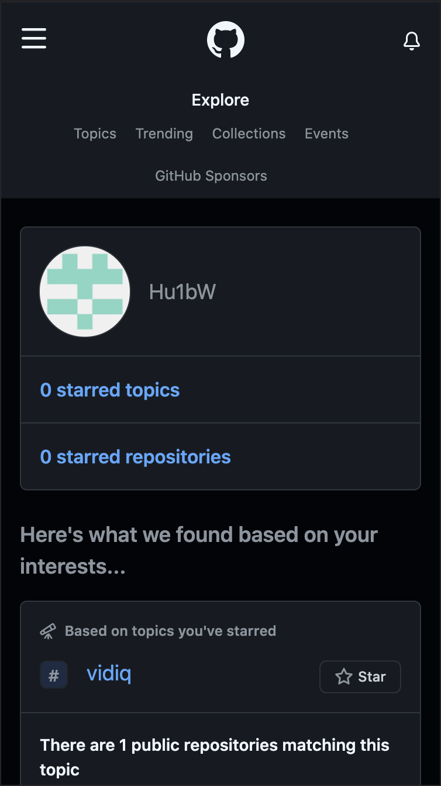
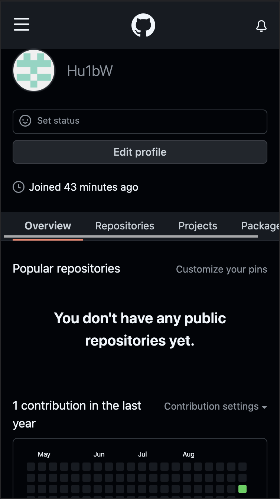
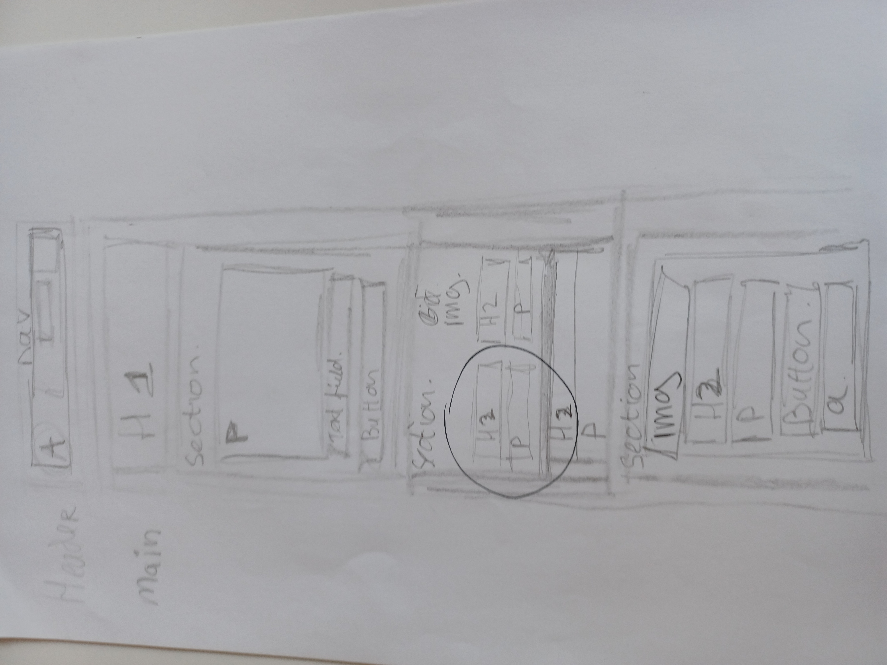
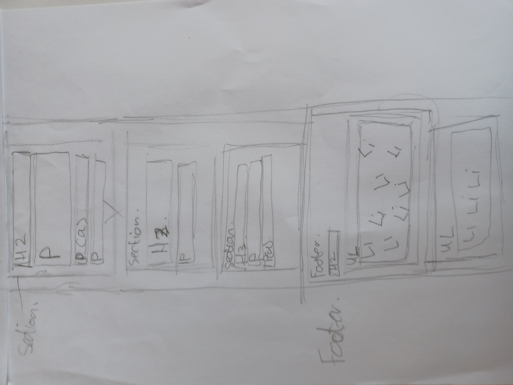
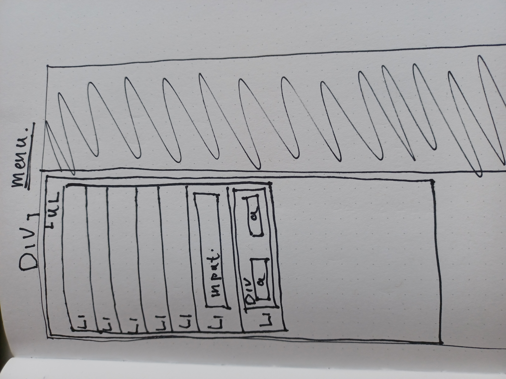
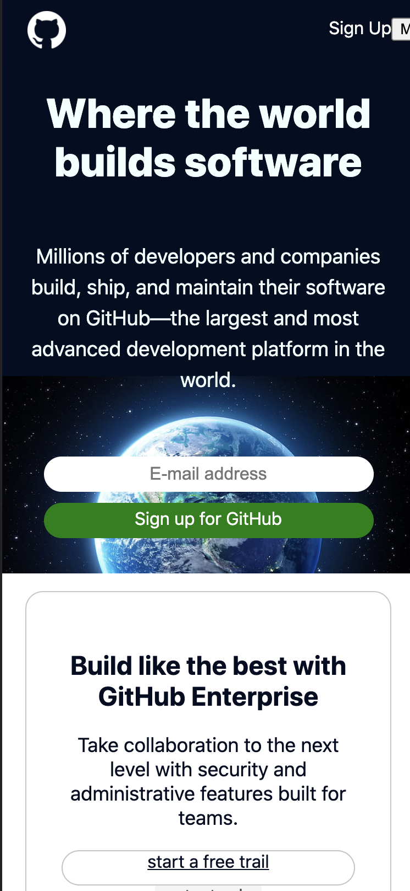
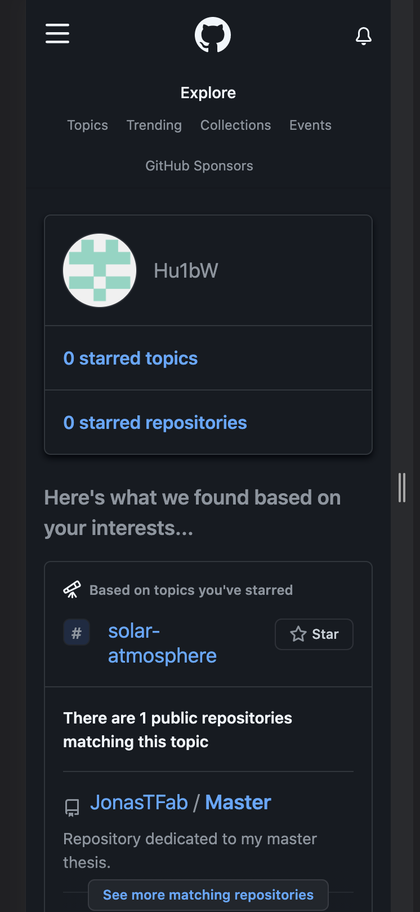
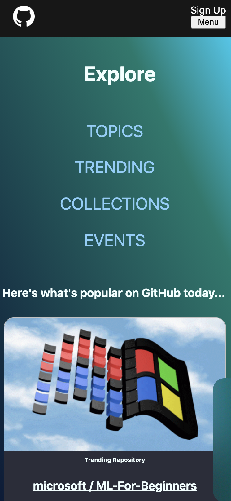

# Procesverslag
Markdown is een simpele manier om HTML te schrijven.  
Markdown cheat cheet: [Hulp bij het schrijven van Markdown](https://github.com/adam-p/markdown-here/wiki/Markdown-Cheatsheet).

Nb. De standaardstructuur en de spartaanse opmaak van de README.md zijn helemaal prima. Het gaat om de inhoud van je procesverslag. Besteedt de tijd voor pracht en praal aan je website.

Nb. Door *open* toe te voegen aan een *details* element kun je deze standaard open zetten. Fijn om dat steeds voor de relevante stuk(ken) te doen.

## Jij

uitwerken voor kick-off werkgroep

### Auteur:
Huib Wezenaar

#### Je startniveau:
Rood

#### Je focus:
extra aandacht voor de surface laag.
 

## Je website

uitwerken voor kick-off werkgroep

### Je opdracht:
www.Github.com

#### Screenshot(s) van de eerste pagina (small screen): 
Explore Page  

#### Screenshot(s) van de tweede pagina (small screen):
Profiel Page

 

## Breakdownschets (week 1)

uitwerken na afloop 2e werkgroep

### de hele pagina: 

### dynamisch deel (bijv menu): 

## Voortgang 1 (week 2)

uitwerken voor 1e voortgang

### Stand van zaken
goed:
    - HTML schrijven ging goed
    - Flexbox gaat lekker
    - Positioneren gaat lekker

Lastig:
    - Motivatie
    - Workload
    - Plannen

### Agenda voor meeting
samen met je groepje opstellen

| Artinjo           | Huib               | Klaudija         | Robin            |
| ---               | ---                | ---              | ---              |
| Hamburger menu    | en dit             | en ik dit        | en dan ik dat    |
| Navigatie         | dit als er tijd is | nog een punt     | dit wil ik zeker |
| ...               | ...                | ...              | ...              |

Agendapunten:

- Hamburger menu
- Navigatie

### Verslag van meeting
hier na afloop snel de uitkomsten van de meeting vastleggen

- Feedback op individuele pagina's
- tips over planning
- tips over het ordenen van de code/css

## Voortgang 2 (week 3)

uitwerken voor 2e voortgang

### Stand van zaken
- grid ging goed, wel beetje onduidelijk wanneer ik het beste bepaalde dingen toe moet passen.
- JS ging lekker.
- footer afbeelding gaat helemaal fout.

### Agenda voor meeting
samen met je groepje opstellen

| Artinjo                                   | Huib                             | klaudija                                       | Robin            |
| ---                                       | ---                              | ---                                            | ---              |
| afbeeldingen positioneren met grid        | Responsive maken en mooi houden  | Tips voor het responsive maken voor desktop    | en dan ik dat    |
| en dat ook nog                            | Footer afbeelding                | nog een punt                                   | dit wil ik zeker |
| ...                                       | ...                              | ...                                            | ...              |

### Verslag van meeting
hier na afloop snel de uitkomsten van de meeting vastleggen

- We hebben met de student-assistenten overlegt wat we kunnen doen om onze problemen op te kunnen lossen.

- We hebben in de resterende tijd een paar leuke tips en sneltoetsen gekregen om tijd te besparen.

- We hebben uitleg gehad over hoe extenties werken in Visual Studio Code.

## Toegankelijkheidstest (week 4)

uitwerken na test in 8e voortgang

### Bevindingen

Safari vind mijn site minder leuk dan Chrome.

----hoofdpagina----
- De Hoofdpagina is goed te zien en de kleuren/contrast hoeven niet verandert te worden.
- Voorlezer struikelt nog over het uitklap menu.
- Een aantal knopjes hebben nog geen alt naam.
- De knopjes zijn goed te bedienen met milde spasmes.
- De interacties zijn simpel.

----Explore----
- Het kleurcontrast van de Explore pagina is niet zo goed gedaan dat je goed de secties kan ondescheiden.
- Het kleurcontrast van het font is wel goed.
- De knopjes en linkjes zijn aan de kleine kant waardoor deze niet goed te bedienen zijn met milde spasmes.  

#### Kleurcontrast
Het kleurcontrast op de hoofdpagina is goed, de verschillende elementen zijn goed van elkaar te onderscheiden met grijswaarden.
Hierdoor is alle content goed te lezen door mensen met (gedeeltelijke) kleurenblindheid.

Het kleurcontrast op de Explore pagina was niet zo goed, daardoor was de content niet goed te zien door mensen met (gedeeltelijke) kleurenblindheid.
Na deze bevinding gedaan te hebben heb ik de pagina er anders laten uitzien ten opzichte van het origineel door meer contrast toe te voegen tussen
de voor- en achtergrond. 
Dit is het origineel, die vond ik niet zo goed leerbaar met de kleurenblind bril(geel) op:

Dit is de aangepaste versie, ik heb meer contrast toegevoegd:

#### Spasmes
Als een persoon spasmes heeft kan hij/zij niet zo goed navigeren met de muis en hierdoor lukt het vaak niet om kleine knopjes in te drukken. 
Ik heb de hyperlink navigatie knopjes groter gemaakt voor zowel de computer, waar ze iets groter zijn en met een grotere padding, en voor de
mobiele telefoon waarbij ze veel groter zijn en onder elkaar komen te staan voor snelle navigatie over een lange pagina, aangezien het hyperlinks
zijn die je naar het desbetreffende artiekel leiden.

#### Aandacht 
Mensen met een aandacht stoornis kunnen vaak moeilijk hun focus bij de site houden als er iets anders gaande is in hun omgeving.
Github houdt hier geen rekening mee omdat er een hele boel kleine elementjes en linkjes en knopjes aanwezig zijn die je moet opzoeken als
je ergens specifiek naar opzoek bent.
 

De elementen zouden groter gemaakt kunnen worden en duidelijker een focus krijgen. De vraag is of dit wel zin zou hebben bij Github omdat
het toch wel een site is voor codeurs die al een beetje weten wat ze doen en als je de elementen veranderd denk ik dat je het grootste deel van
de bezoekers hiermee irriteert.

## Voortgang 3 (week 4)

uitwerken voor 3e voortgang

### Stand van zaken
hier dit ging goed & dit was lastig (neem ook screenshots op van delen van je website en code)

### Agenda voor meeting
samen met je groepje opstellen

| Artinjo        | Huib               | Klaudija                        | Robin            |
| ---            | ---                | ---                             | ---              |
| dit bespreken  | en dit             | SVG                             | en dan ik dat    |
| en dat ook nog | dit als er tijd is | Grootte responsive schermen     | dit wil ik zeker |
| ...            | ...                | ...                             | ...              |

### Verslag van meeting
hier na afloop snel de uitkomsten van de meeting vastleggen

- We zijn over de benodigheden gegaan die we nodig hebben om een voldoende te kunnen halen.
- De vragen die we hadden zijn beantwoord maar verder was het een korte meeting waar we niet veel hebben besproken.

## Eindgesprek (week 5)

uitwerken voor eindgesprek

### Stand van zaken
hier dit ging goed & dit was lastig (neem ook screenshots op van delen van je website en code)

### Screenshot(s)

hier screenshot(s) van je eindresultaat

## Bronnenlijst

continu bijhouden terwijl je werkt

Nb. Wees specifiek ('css-tricks' als bron is bijv. niet specifiek genoeg).

1. http://Github.com, Ik heb de footer afbeelding van de hoofdpagina geleend van de originele site.
2. https://github.com/explore Ik heb de profielfotos van de trending programmers gebruikt.
3. https://www.wallpaperflare.com/earth-moon-nature-hd-4k-digital-universe-space-planet-space-wallpaper-hrwph Gebruikt voor de afbeelding op de hoofdpagina.
4. https://www.pexels.com/photo/wonderful-starry-sky-at-night-5362479/ Gebruikt op de hoofdpagina als achtergrond bij de contribute section.
5. https://www.giphy.com Gebruikt voor het windows logo op de explore pagina.
6. https://commons.wikimedia.org/wiki/File:Hamburger_icon_white.svg voor het witte hamburger menu's

